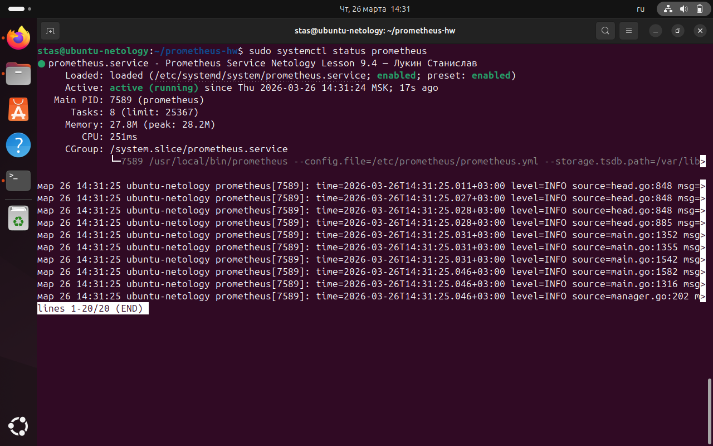
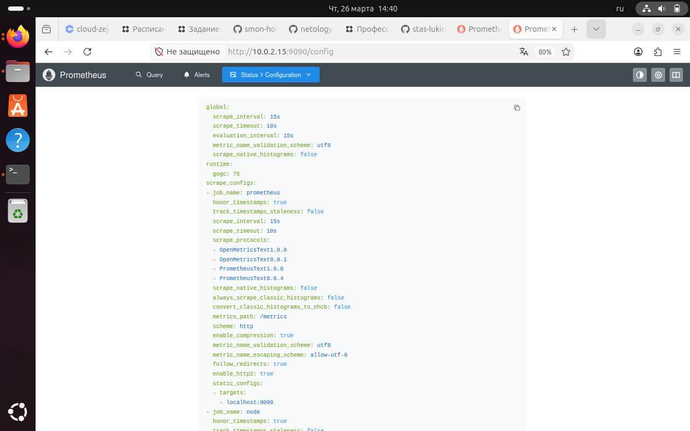
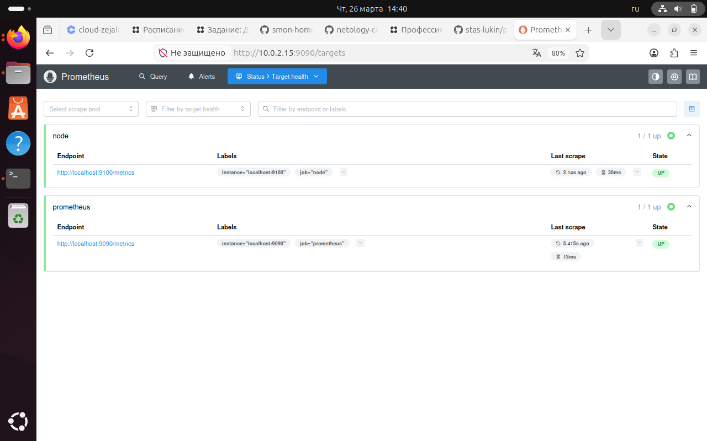

# Домашнее задание к занятию "Система мониторинга Prometheus" — Лукин Станислав
### Инструкция по выполнению домашнего задания
(оставьте здесь текст инструкции из шаблона, если он был)
---
## Задание 1. Установка Prometheus
**Решение:**
1. Создал пользователя `prometheus`:
   ```bash
   sudo useradd --no-create-home --shell /bin/false prometheus
    Скачал и распаковал Prometheus версии 3.9.1:
   cd /tmp
    wget https://github.com/prometheus/prometheus/releases/download/v3.9.1/prometheus-3.9.1.linux-amd64.tar.gz
    tar xvf prometheus-3.9.1.linux-amd64.tar.gz
    cd prometheus-3.9.1.linux-amd64
    Создал директории и скопировал файлы:
    sudo mkdir /etc/prometheus /var/lib/prometheus
    sudo cp prometheus promtool /usr/local/bin/
    sudo cp -r consoles/ console_libraries/ /etc/prometheus/
    sudo cp prometheus.yml /etc/prometheus/
    sudo chown -R prometheus:prometheus /etc/prometheus /var/lib/prometheus /usr/local/bin/prometheus /usr/local/bin/promtool
    Создал systemd-сервис /etc/systemd/system/prometheus.service:
    [Unit]
    Description=Prometheus Service Netology Lesson 9.4 — Лукин Станислав
    After=network.target
    [Service]
    User=prometheus
    Group=prometheus
    Type=simple
    ExecStart=/usr/local/bin/prometheus \
        --config.file=/etc/prometheus/prometheus.yml \
        --storage.tsdb.path=/var/lib/prometheus/
    [Install]
    WantedBy=multi-user.target
    Запустил и проверил работу:
    sudo systemctl daemon-reload
    sudo systemctl start prometheus
    sudo systemctl enable prometheus
    sudo systemctl status prometheus
Скриншот:

Задание 2. Установка Node Exporter
Решение:
    Скачал и распаковал Node Exporter версии 1.8.2:
   cd /tmp
    wget https://github.com/prometheus/node_exporter/releases/download/v1.8.2/node_exporter-1.8.2.linux-amd64.tar.gz
    tar xvf node_exporter-1.8.2.linux-amd64.tar.gz
    cd node_exporter-1.8.2.linux-amd64
    Скопировал бинарный файл и создал пользователя:
    sudo cp node_exporter /usr/local/bin/
    sudo useradd --no-create-home --shell /bin/false node_exporter
    Создал systemd-сервис /etc/systemd/system/node-exporter.service:
    [Unit]
    Description=Node Exporter Netology Lesson 9.4 — Лукин Станислав
    After=network.target
    [Service]
    User=node_exporter
    Group=node_exporter
    Type=simple
    ExecStart=/usr/local/bin/node_exporter
    [Install]
    WantedBy=multi-user.target
    Запустил и проверил:
    sudo systemctl daemon-reload
    sudo systemctl start node-exporter
    sudo systemctl enable node-exporter
    sudo systemctl status node-exporter
Скриншот:

Задание 3. Подключение Node Exporter к Prometheus
Решение:
    Отредактировал конфигурационный файл /etc/prometheus/prometheus.yml:
    global:
      scrape_interval: 15s
    scrape_configs:
      - job_name: "prometheus"
        static_configs:
          - targets: ["localhost:9090"]
      - job_name: "node"
        static_configs:
          - targets: ["localhost:9100"]
    Перезапустил Prometheus:
    sudo systemctl restart prometheus
    Проверил в веб-интерфейсе:
        Конфигурация: http://10.0.2.15:9090/config
        Цели: http://10.0.2.15:9090/targets
Скриншоты:


Заключение
В результате выполнения домашнего задания:
    Установлен и настроен Prometheus с автоматическим запуском через systemd.
    Установлен и настроен Node Exporter.
    Произведена интеграция Node Exporter в конфигурацию Prometheus.
    Проверена работа целей в веб-интерфейсе.
Ссылка на репозиторий:
https://github.com/stas-lukin/prometheus-hw
ENDOFFILE
text
---
